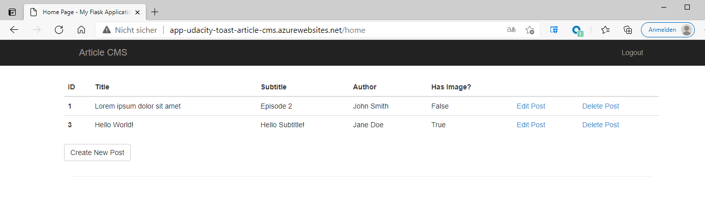

# Write-up

# Link to the website:
https://app-udacity-toast-article-cms.azurewebsites.net/

## Analyze, choose, and justify the appropriate resource option for deploying the app.

### Resource Justifiaction

For hosting our app, we compare Azure App Service (PaaS) and Azure VM (IaaS).
Since it is a very lightweight app that does not require high performance computing, we compare the most affordable tiers and sizes in the [Azure Pricing Calculator](https://azure.microsoft.com/en-us/pricing/calculator/).

**VM**

**App Service**

The app service costs $0.50 less per month (730h) compared to the VM.

 Azure App Service has high availability with an uptime of 99.95% according to its [SLA](https://azure.microsoft.com/en-us/support/legal/sla/app-service/v1_4/).
 The [SLA](https://azure.microsoft.com/en-us/support/legal/sla/virtual-machines/v1_9/) of an Azure VM depends on the disks we are using (95% - 99.9%). Using an Availabilty Set (99.95%) or an Availability Zone (99.99%) improves the availabily.

 The VM we chose has a guaranteed availability of 99.5%.
 To get the same 99.95% availability our app service has, we'd need to have an Availability Set. Creating it with a second VM would double the costs.

Both VMs and App Services are scalable. App Services have some hardware limitations, e.g. max. 14 GB RAM and 4 vCPU cores per instance.
For our lightweight app, these limitations are not a problem.

Based on above arguments, we are going to host the app as an App Service. It's less expensive and provides higher availability. If we wanted to achieve the same availability with an Azure VM, it would be even more costly. Our app also doesn't require any additional software or OS changes. App Services support Python 3.7 which we are using for our app. So we don't need an IaaS solution.
___
### Assess app changes that would change your decision.
If we have to use an app stack that Azure App Services doesn't support yet, we will install the necessary software on a VM and host the app there.

Also, if the load of the app increases drasticly so that our app service cannot handle it anymore, e.g. many concurrent user sessions, and we cannot scale up or out anymore, we need to switch to a VM. 

If there are security reasons that require use to have dedicated servers for our app, we'll have to move the app to a VM, too.
___
## Screenshots

### Home

### Create New Post

### Edit Post

### Resource Group

### SQL

### Blob

### Log Stream

### AAD

